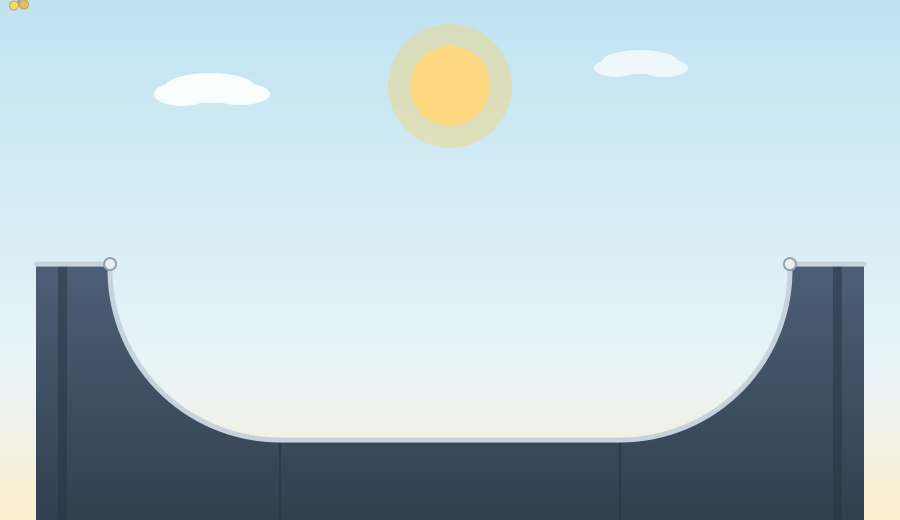

# risorseartificiali-bench

A minimal, harness-free benchmark based on the [risorseartificiali.com/skateboard](https://risorseartificiali.com/skateboard) task: send a fixed prompt to any OpenAI-compatible `chat/completions` endpoint and save the animated SVG it produces.

`skateboard_bench.py` ships two prompts:

- **minimal** — the original one-liner, typos included ("*generate an animated svg of a man doing skatevoard tricks on a pipe. Be mindful of the real phisics*").
- **constrained** — a fully specified variant (half-pipe, recognizable skater + board, aerial trick, pendulum/parabolic physics, SMIL/CSS only, seamless loop).

The script streams the response (SSE), extracts the `<svg>`, and writes it to `results/<model>-<prompt>.svg` next to a JSON metadata file (finish reason, token usage, animation detected). TCP keepalive is patched onto `http.client` so long reasoning phases survive gateway paths that reset idle flows.

## Usage

```sh
python3 skateboard_bench.py [--prompt minimal|constrained] [--no-think] \
    [--base URL] [--model NAME] [--max-tokens N]
```

Defaults: `http://192.168.11.36:8889/v1`, model `glm-5.3-flash`, 16k max tokens. `--no-think` disables GLM thinking via `chat_template_kwargs`. Auth only when hitting a gateway: set `LITELLM_KEY` / `LITELLM_API_KEY`.

## Results (glm-5.3-flash)

Both animations below were generated by `glm-5.3-flash` from this repo's two prompts (SMIL, seamless loops).

### Constrained prompt

<p align="center">
  
</p>

### Minimal prompt

<p align="center">
  
</p>

Open them directly in a browser (or any SMIL-capable viewer) if your markdown renderer doesn't animate inline SVGs.

## License

Apache-2.0 — see [LICENSE](LICENSE).
